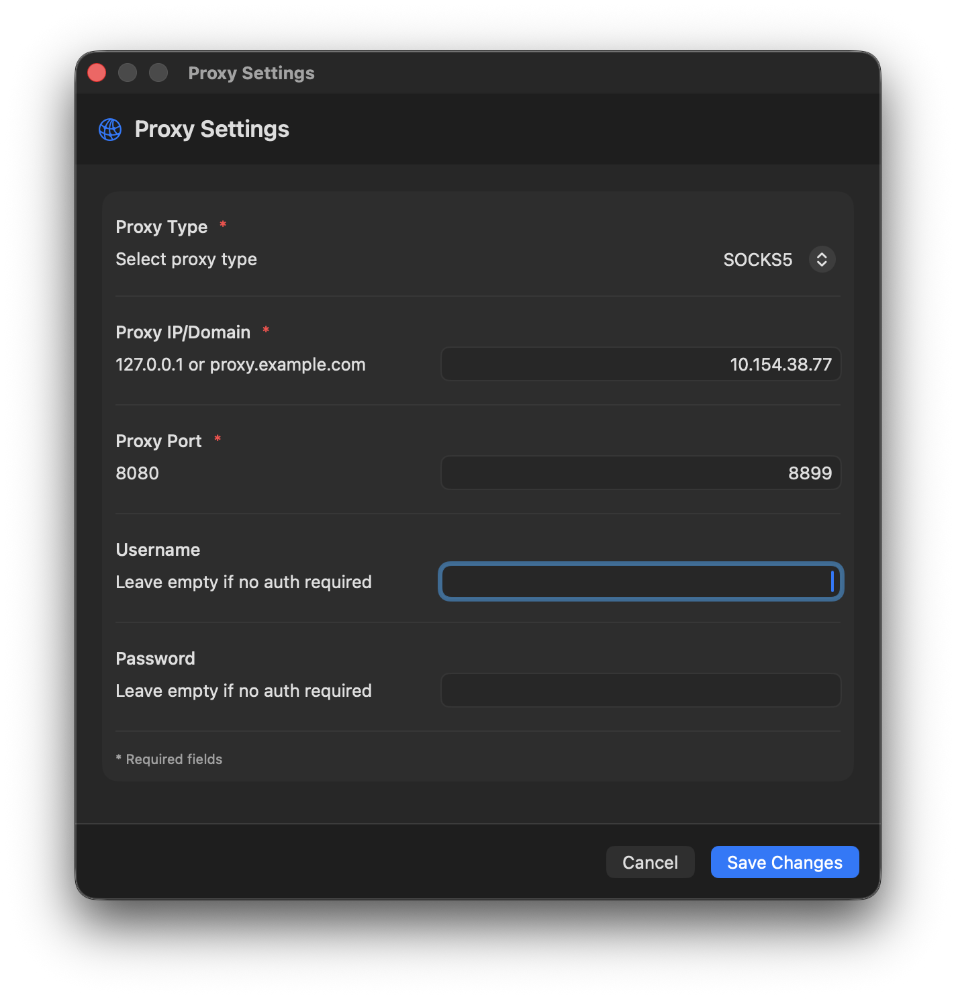
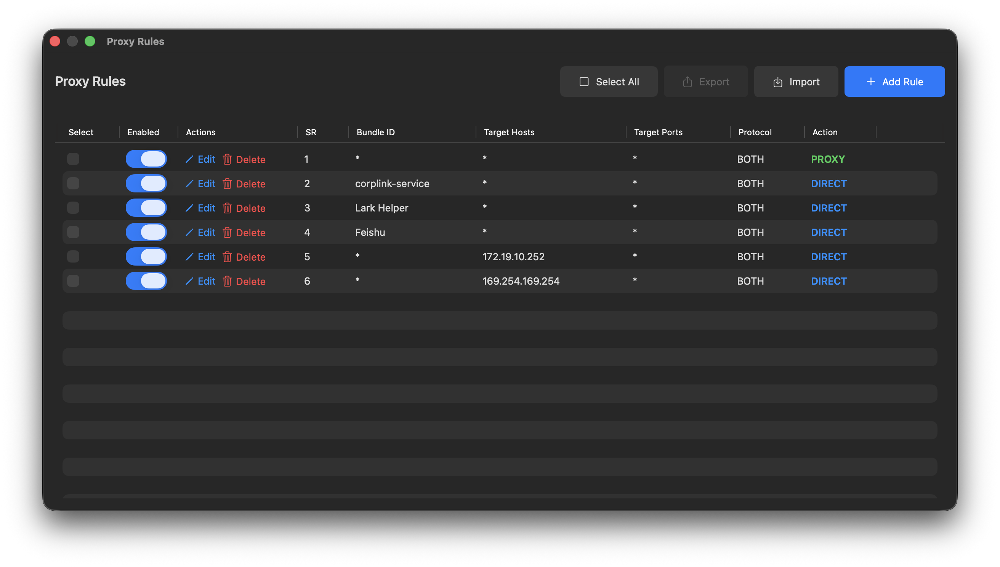

# Pantyhose

[English](README.md) | 中文

一个轻量级 SOCKS5 forward proxy server，使用 Go 编写。在有网络出口的机器上运行（如公司专线 Windows 电脑），让其他机器通过 [ProxyBridge](https://github.com/InterceptSuite/ProxyBridge)、[Proxifier](https://www.proxifier.com/) 等工具将全部网络流量代理过来。

基于 [txthinking/socks5](https://github.com/txthinking/socks5) 构建，支持 TCP (CONNECT) 和 UDP (UDP ASSOCIATE)，可选 username/password 认证。TLS SNI remap 默认开启(处理客户端使用飞连VPN时飞连导致的DNS污染)，IPv6 默认禁用。

## 使用场景

``` txt
┌──────────────────────┐                            ┌─────────────────────────┐
│  macOS / Linux / Win │                            │  Windows（公司内网）      │
│                      │          VPN / LAN         │                         │
│  ProxyBridge/        │   ──────────────────────►  │  pantyhose.exe          │
│  Proxifier           │                            │  (默认: SNI 开)         │
│                      │       SOCKS5 (TCP+UDP)     │         │               │
│  全部流量代理          │   ──────────────────────►  │         ▼               │
│                      │                            │  公司专线               │
│                      │                            │  (可访问外网)            │
└──────────────────────┘                            └─────────────────────────┘
```

**典型场景**：公司 Windows 电脑通过专线可以直接访问外网（YouTube、Google 等）。个人 macOS/Linux 电脑通过 VPN（如飞连 CorpLink）连接公司内网，但 DNS 被污染。Pantyhose 将两者打通——实现个人电脑的VPN全部流量通过公司电脑的网络出口转发进而实现等效"全内网"环境。

## 快速开始

```bash
# 默认配置启动（SNI remap 开启，IPv6 禁用，端口 1080）
pantyhose.exe

# 启用，连接需用户名密码认证
pantyhose.exe --user admin --pass secret

# 自定义端口
pantyhose.exe --port 8899

# 允许 IPv6 出站 (但通常公司专线不提供ipv6的地址)，可通过https://www.whatismyip.com/测试
pantyhose.exe --enable-ipv6
```

## 客户端配置

### ProxyBridge（推荐）

[ProxyBridge](https://github.com/InterceptSuite/ProxyBridge) 是一个跨平台的 Proxifier 替代品，在内核层拦截所有 TCP/UDP 流量。

1. 在客户端机器（macOS/Windows/Linux）上安装 ProxyBridge

2. **Proxy Settings**：在菜单栏 **Proxy > Proxy Settings...** 中，将 **Proxy IP/Domain** 设置为`<pantyhose 机器 IP>`（如 `10.154.38.77`），**Proxy Port** 设置为 pantyhose 监听端口（默认 `1080`）。



3. **Proxy Rules**：在 **Proxy > Proxy Rules...** 中配置路由规则。飞连 VPN 相关的进程和地址（如 `corplink-service`、`Lark Helper`、`Feishu`、`169.254.169.254`、`172.19.10.252`）应设置为 **BOTH** 协议 + **DIRECT** 动作以绕过代理。其他流量走代理。



> **提示**：在客户端系统网络设置里禁用 IPv6 可以进一步减少 DNS 污染问题：
>
> ```powershell
> # Windows 客户端
> reg add "HKLM\SYSTEM\CurrentControlSet\Services\Tcpip6\Parameters" /v DisabledComponents /t REG_DWORD /d 0xFF /f
>
> # macOS 客户端
> sudo networksetup -setv6off Wi-Fi
> ```

### Proxifier

1. 安装 [Proxifier](https://www.proxifier.com/)
2. 进入 **Profile > Proxy Servers > Add**
3. 填入：
   - Address: `<pantyhose 机器 IP>`
   - Port: `1080`
   - Protocol: **SOCKS Version 5**
   - Authentication: 如有配置，填入用户名密码
4. 配置 **Proxification Rules** 路由所需流量
5. 启用 **"Resolve hostnames through proxy"** 实现完整 DNS 代理

## 防火墙

服务监听 TCP+UDP 端口。Windows 防火墙可能阻止入站连接。在代理机器上**以管理员身份**运行：

```powershell
# TCP（所有连接必需）
netsh advfirewall firewall add rule name="pantyhose-tcp" dir=in action=allow protocol=TCP localport=1080

# UDP（UDP ASSOCIATE / QUIC / DNS 代理必需）
netsh advfirewall firewall add rule name="pantyhose-udp" dir=in action=allow protocol=UDP localport=1080
```

如使用非默认端口，将 `1080` 替换为实际端口。**两条规则都必须添加**——缺少 UDP 规则会导致客户端出现 "The peer closed the flow" 错误。

清理防火墙规则：

```bash
pantyhose.exe --fw-clean
pantyhose.exe --fw-clean --port 8899  # 自定义端口
```

## 开发上手

### 从源码编译

需要 [Go 1.21+](https://go.dev/dl/)。

```bash
git clone <repo-url>
cd pantyhose
go build -o pantyhose.exe .
```

### 交叉编译 Linux 版本（可选）

```bash
GOOS=linux GOARCH=amd64 go build -o pantyhose .
```

## 参数说明

```txt
pantyhose.exe [参数]

参数:
  --addr string        监听地址 (默认 "0.0.0.0")
  --port int           监听端口 (默认 1080)
  --ip string          UDP ASSOCIATE 回复使用的出站 IP（留空自动检测）
  --user string        SOCKS5 认证用户名（留空不启用认证）
  --pass string        SOCKS5 认证密码（留空不启用认证）
  --tcp-timeout int    TCP 连接空闲超时，单位秒 (默认 60)
  --udp-timeout int    UDP 会话超时，单位秒 (默认 60)
  --enable-ipv6        允许 IPv6 出站连接（默认禁用）
  --no-sni-remap       禁用 TLS SNI 域名重解析（默认启用）
  --sni-ports string   应用 SNI remap 的端口列表，逗号分隔 (默认 "443")
  --verbose            启用详细日志
  --fw-clean           输出删除防火墙规则的命令后退出
  --help-cn            显示中文帮助信息
  --version            显示版本号
```

### 认证模式

- **无认证**：不传 `--user` 和 `--pass`
- **用户名/密码认证**：同时传入 `--user` 和 `--pass`

## 核心功能

### IPv6 处理（默认禁用 / `--enable-ipv6`）

**默认行为**：IPv6 默认禁用，所有出站连接强制使用 IPv4。这避免了客户端 DNS 解析到 IPv6 地址后连接超时的问题（公司网络通常没有 IPv6 路由）。

**`--enable-ipv6`**：强制启用 IPv6 出站。仅在确认代理机器有可用的 IPv6 网络时使用。

### SNI Remap（默认启用 / `--no-sni-remap`）

SNI remap **默认启用**，用于解决 VPN 客户端（如飞连 CorpLink）导致的 DNS 污染问题。

**问题**：客户端的 DNS 被污染（VPN 客户端返回虚假 IP）。[ProxyBridge](https://github.com/InterceptSuite/ProxyBridge) 等工具在内核层拦截流量，发送给 SOCKS5 proxy 的是已经解析好的 IP 地址而非域名。代理连接到虚假 IP 后失败。

**解决方案**：Pantyhose 拦截 HTTPS 连接（默认 443 端口），读取 TLS ClientHello 提取 SNI hostname，然后通过代理机器的本地 DNS 重新解析域名，连接到正确的 IP。

**工作原理**：

```txt
1. 客户端 DNS（被污染）:  youtube.com → 185.45.5.35（虚假 IP）
2. ProxyBridge 发送:      CONNECT 185.45.5.35:443
3. Pantyhose 读取 TLS ClientHello → SNI = "www.youtube.com"
4. Pantyhose 重新解析:    youtube.com → 142.251.10.91（正确 IP，通过公司 DNS）
5. Pantyhose 连接:        142.251.10.91:443 ✓
```

**`--no-sni-remap`**：完全禁用 SNI remap。如果没有 DNS 污染问题，可以用此参数切换为纯 SOCKS5 proxy 模式。

**限制**：仅对 TLS 流量有效（依赖 TLS SNI）。非 TLS 流量会直接转发。

自定义 SNI remap 端口：

```bash
# 在 443、8443、4443 端口上启用 SNI 嗅探
pantyhose.exe --sni-ports 443,8443,4443
```

### 默认配置

直接运行 `pantyhose.exe` 即为**推荐配置**：

- SNI remap 启用（修复 DNS 污染）
- IPv6 禁用（避免超时）
- 监听 `0.0.0.0:1080`
- 无认证

## 故障排查

### 客户端完全无法连接

- 确认代理机器 IP 可达：`ping <proxy-ip>`
- 检查 TCP 和 UDP 防火墙规则是否都已添加（见防火墙章节）
- 确认 pantyhose 正在运行：查看日志中的 `SOCKS5 server listening on ...`

### IPv6 连接超时

```txt
dial tcp [2404:6800:4012:6::200e]:443: connectex: A connection attempt failed...
```

代理机器没有 IPv6 网络。默认已禁用 IPv6，此问题不应出现。如果出现，检查是否误加了 `--enable-ipv6`。

### DNS 污染（IP 错误，代理机器能访问的网站客户端无法访问）

```txt
dial tcp4 185.45.5.35:443: connectex: A connection attempt failed...
```

客户端 DNS 返回虚假 IP。SNI remap 默认启用，应自动处理此问题。可通过对比 DNS 结果确认：

```bash
# 在客户端
nslookup www.youtube.com
# 在代理机器
nslookup www.youtube.com
```

如果结果不同，说明存在 DNS 污染。

### "The peer closed the flow"（ProxyBridge）

缺少 UDP 防火墙规则。添加 UDP 规则（见防火墙章节）。

### 部分网站代理机器能访问但通过代理不行

- HTTPS 网站：确认 SNI remap 已启用（默认启用，查看日志中的 "SNI remap enabled"）
- HTTP 网站：客户端 DNS 返回虚假 IP 且无 SNI 可提取。考虑在客户端 `/etc/hosts` 中添加正确 IP

## 测试

### 自动化测试

```bash
go test -v -count=1 -timeout 60s ./...
```

### 通过 WSL 或其他机器手动验证

```bash
# 测试 TCP 代理（无认证）
curl --socks5 <host-ip>:1080 http://httpbin.org/ip

# 测试 TCP 代理（有认证）
curl --socks5 <host-ip>:1080 --proxy-user admin:secret http://httpbin.org/ip

# 测试 DNS 解析通过代理
curl --socks5-hostname <host-ip>:1080 http://httpbin.org/ip

# 测试 HTTPS 通过代理
curl --socks5 <host-ip>:1080 https://www.google.com -o /dev/null -w "%{http_code}\n"
```

将 `<host-ip>` 替换为代理机器的内网 IP（启动日志中 "Using outbound IP: x.x.x.x" 显示的地址）。

## License

MIT
